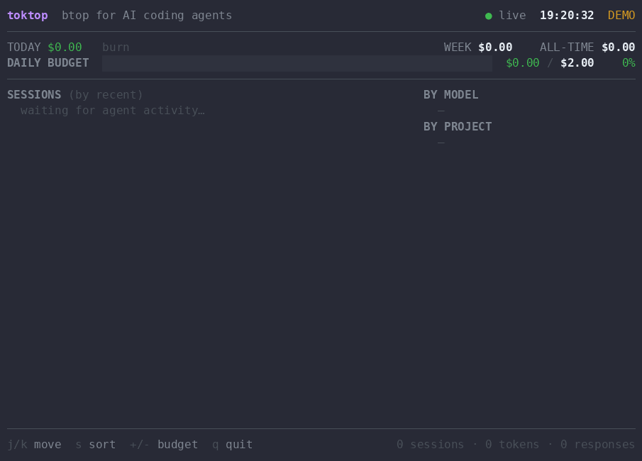

<div align="center">

# `toktop`

### btop for your AI coding agents. Watch the money tick. Locally. No signup.

<sub>(<code>toktop</code> = **tok**en + **top** — same genre as <code>htop</code> / <code>btop</code>)</sub>

**A single runaway agent loop can quietly burn hundreds of dollars while you're at lunch. `toktop` shows you exactly what Claude Code is costing you — live, per session, project and model — with a daily budget bar that turns red before your bill does. One static binary. No signup. No network.**

[](https://github.com/furkanalp41/toktop/actions/workflows/ci.yml)
[](https://goreportcard.com/report/github.com/furkanalp41/toktop)
[](https://github.com/furkanalp41/toktop/releases)
[](LICENSE)

[](https://github.com/furkanalp41/toktop/stargazers)



<sub>Don't have the GIF yet? Run <code>toktop --demo</code> and you'll see this live in your own terminal.</sub>

</div>

---

```
 toktop  btop for AI coding agents                              ● live  17:39:33  DEMO
 ────────────────────────────────────────────────────────────────────────────────────
 TODAY $5.47   burn ▂▄▆▂▂▆▂▅▁▄▁▂▆█▁▂          WEEK $5.47        ALL-TIME $5.47
 DAILY BUDGET  ████████████████████████████████████████████████  $5.47 / $5.00   109%
  ⚠  DAILY BUDGET EXCEEDED  ·  $0.47 over $5.00
 ────────────────────────────────────────────────────────────────────────────────────
 SESSIONS (by recent)                              BY MODEL
 ▸ api-gateway      $4.18  ▄▄▆▆▅▄▆█  opus    now    claude-opus-4-8     $4.18   76%
   web-frontend     $0.95  ▇▆█▅▅▄▇█  sonnet  now    claude-sonnet-4-6   $1.20   22%
   data-pipeline    $0.34  ▁▂▁▂▃▁▂▄  haiku   2s     claude-haiku-4-5    $0.34    6%
                                                     BY PROJECT
                                                     api-gateway         $4.18
                                                     web-frontend        $0.95
                                                     data-pipeline       $0.34
 ────────────────────────────────────────────────────────────────────────────────────
 j/k move  s sort  +/- budget  q quit             3 sessions · 2.0M tokens · 75 responses
```

<sub>The hero shows `toktop --demo` with a `$5` cap so you can see the red over-budget state — the real default is `$20/day` (override with `--budget` or `$TOKTOP_BUDGET`).</sub>

## Why

- **Runaway agent bills are real.** Coding agents loop, retry, and re-read huge contexts. People wake up to surprise invoices — a single bad loop can burn through hundreds of dollars while you're at lunch.
- **Every other cost tool is a cloud dashboard you have to sign into.** Langfuse, Helicone, provider consoles — all require an account, a proxy, or shipping your traffic somewhere. You just want to *glance* at what's happening on your own machine.
- **Your token logs should never leave your laptop.** `toktop` reads the session logs that are *already on disk*, read-only, and **never makes a single network call.**

## Install

**One line (macOS / Linux):**

```sh
curl -fsSL https://raw.githubusercontent.com/furkanalp41/toktop/main/install.sh | sh
```

Prefer to read it first (recommended)?

```sh
curl -fsSL https://raw.githubusercontent.com/furkanalp41/toktop/main/install.sh -o install.sh
less install.sh && sh install.sh   # checksums are published on every release
```

**Homebrew** *(once the tap is published):*

```sh
brew install furkanalp41/tap/toktop
```

**Go (1.22+):**

```sh
go install github.com/furkanalp41/toktop@latest
```

**Windows:** download `toktop_<version>_windows_amd64.zip` from [Releases](https://github.com/furkanalp41/toktop/releases) and put `toktop.exe` on your `PATH`.

It's a single static binary — no runtime, no dependencies.

## Use

```sh
toktop                  # auto-discovers your sessions; default budget $20/day
toktop --demo           # stream synthetic data — see it light up instantly
toktop --budget 25      # set a $25/day budget (turns the bar red when crossed)
toktop --once           # print a one-shot summary and exit (great for scripts / CI)
toktop --once --by-cost # one-shot, sorted by biggest spenders
```

| Key | Action |
|-----|--------|
| `j` / `k` | move the session selection |
| `s` | toggle sort (recent ⇄ spend) |
| `+` / `-` | nudge the daily budget |
| `q` | quit |

## Features

| | |
|---|---|
| 💸 **Live cost** | Per-session, per-project, per-model dollars updating as your agents work |
| 🚨 **Budget bar + alerts** | Green → amber → red against a daily cap; a flash and a terminal bell the moment you cross it. *(Alerts only today — it doesn't stop the agent yet; a hard kill-switch is on the roadmap.)* |
| 🧮 **Cache-aware pricing** | Counts cache reads, 5-minute and 1-hour cache writes at their distinct rates — so the dollar number is *believable* |
| 🎯 **Counts responses, not lines** | De-duplicates by API message id, so multi-line transcripts aren't over-counted (a ~3-4× trap) |
| 🔌 **Multi-agent** | Claude Code first-class; Codex & Gemini CLI experimental |
| ⚡ **Zero-config** | One binary, runs with no flags, auto-discovers your sessions |
| 🔒 **Fully local** | Read-only over local logs. No account, no proxy, no network. MIT. |

## Supported agents

| Agent | Status | Source |
|-------|--------|--------|
| **Claude Code** | ✅ First-class (verified against real logs) | `~/.claude/projects/**/*.jsonl` |
| **OpenAI Codex CLI** | 🧪 Experimental | `~/.codex/sessions/**/*.jsonl` |
| **Gemini CLI** | 🧪 Experimental | `~/.gemini/**` |

Experimental parsers are conservative: if a log doesn't carry explicit token usage, that agent simply shows nothing rather than a wrong number. (That guarantee is about token *counts* — an experimental agent's *cost* is computed with an estimated Claude-shaped fallback rate, shown with a `~est` marker, until a model-specific price is added.) PRs to harden them are very welcome — see [CONTRIBUTING](CONTRIBUTING.md).

## How it works

`toktop` discovers your local agent session logs, tails them with a file-watcher, and turns the token counts they already record into dollars using a built-in, **editable** pricing table. That's it. There is no server, no database, no auth, and no network access — the only state involved is the files already on your disk.

## Configuration

**Daily budget** — `--budget 25`, or set `TOKTOP_BUDGET=25`.

**Prices drift, so they're data, not code.** Drop a file at `~/.config/toktop/pricing.toml` (or point `TOKTOP_PRICING` at one) to override any model's price without waiting for a release:

```toml
# USD per 1,000,000 tokens. cache_read/cache_write_* default to
# input * 0.10 / 1.25 / 2.00 when omitted.
[[model]]
match  = ["opus"]
input  = 15.0
output = 75.0
```

The longest matching `match` substring wins, and unknown models fall back to an estimate that's clearly flagged in the UI (look for the `~est` marker).

**Pointing at non-default locations** — `TOKTOP_CLAUDE_DIR`, `TOKTOP_CODEX_DIR`, `TOKTOP_GEMINI_DIR`.

## Roadmap

- [ ] **Opt-in hard budget enforcement** — a kill-switch that can actually *stop* an agent before it blows your cap (v0.2).
- [ ] Hardened Codex & Gemini CLI parsers from real-world logs.
- [ ] Per-day history view and CSV/JSON export.
- [ ] `toktop --watch-cost N` to exit non-zero in CI when a run exceeds a threshold.

## Privacy

`toktop` is **100% local**. It opens your session logs read-only, computes cost from a table compiled into the binary, and never opens a socket. No telemetry. No accounts. [Read the code](internal/) — it's small on purpose.

**Verify it yourself** — this isn't just a promise:

```sh
go test -run TestNoNetworkImports ./...   # fails if any code imports net / net/http / crypto/tls / os/exec
strace -f -e trace=network toktop --once  # Linux: watch it open zero connections
```

## Contributing

Issues and PRs welcome — especially log-format samples for Codex/Gemini and pricing updates. See [CONTRIBUTING.md](CONTRIBUTING.md). Be kind; ship a GIF.

## Star history

<a href="https://star-history.com/#furkanalp41/toktop&Date">
  
</a>

## License

[MIT](LICENSE) — do whatever you want, just don't sue us.
